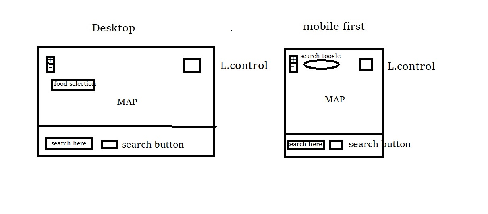
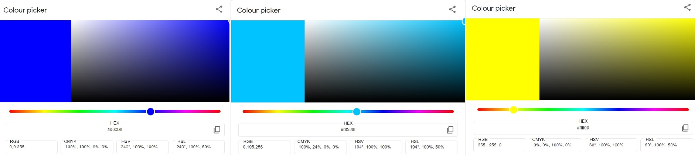

<a href="https://timely-narwhal-5b3f46.netlify.app/">Where2Eat@SG</a>

Summary

The themes for this project is Singapore Foods. Where2Eat@SG is a web apps with an interactive map that allows user to search for local food within Singapore using Four SWquare API. It has a customised dropdown button for select food type such as Chinese, Indian, Indonesia, Western, ect..  

UI/UX:

Url:<a href="https://github.com/sudinojkt/20221019-TrentGlobal-Project-01/tree/main/ui/ux">UI/UX</a>

User Goal:

A customise web apps that search for food in just a fews click and not worries about keyword to input. 

Company  Goal:

The National Heritage Board roles is promoting the heritage of our diverse communities and cultural.
Therefore, I think Singapore food fit into my Project theme.

Color scheme:

Url: <a href="https://github.com/sudinojkt/20221019-TrentGlobal-Project-01/tree/main/colour">Colour Scheme</a>

Colour Photo

These colour are choosen because it assimilate to the map colour. I try to avoid colour blindess deficiency user therefore red and green wan't use. However, yellow colour was used on the toggle button becasue I could applies other colour successfully.

Fonts: 

inherit

Features:

<a href="https://timely-narwhal-5b3f46.netlify.app/">Features</a>

Limitations and Future Implementations: 

Subjected to constrain, I'm unable find a meaningful API to add-on at the moment and make use of the L.Control. But, I shall try again the next opportunity arise and also add more features in this project. <b>Note:<b> The search result sometime unable to grab photo and info. I suspect this limitation lies with the fetching or pushing of data to Four Square.      

Technologies Used;

1. HTML – markup language for create document pages
2. CSS - styling of HTML elements
3. Bootstrap 5.2 – cdn for styling
4. Leaflet - JavaScript library used to build web mapping applications
5. Axios - Promise based HTTP client for the browser and node.js
6. Four Square - for the place search API

Test Case:

<a href="https://github.com/sudinojkt/20221019-TrentGlobal-Project-01/tree/main/test-results">Test Case</a>
This web apps has been tested for responsiveness using Chrome and Edge browser's Developer Tools on both mobile and desktop size. 

Deployment:

The website is hosted using Netlify, and deployed directly on the main branch of Github repository. 

Credits and Acknowledgement:

Kunxin-Chor : boilerplate
Leaflet :  css stylesheet
Font Awesome : button icon 
Axios : script for css and js
Bootstrap : cdn and script
Welsy and Arif : coaching